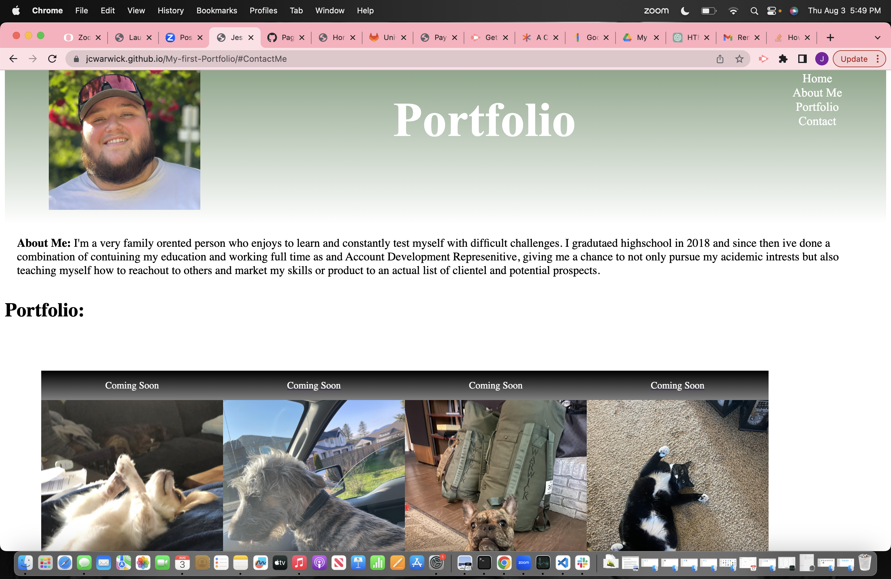

# My-first-Portfolio
[deployed page](https://jcwarwick.github.io/My-first-Portfolio/#ContactMe)

In this project I created my first site using Html and CSS with 0 starter code. While creating my portfolio I demonstrated my ability to properly use 

-Html elements 

-Write the code with proper syntax,

-use classes pseudo-classes,:hover, and media queries. 

The page includes 

-shows developers name, page title, and a nav with links to sections

-click one of those links and it moves to that section(best demonstrated with the contact me section)

-All photos are links that take you to a new page(all link to google with TA approvl as I have no material for the portfolio at this point in our class)

-the first application is a larger size than the rest 

-when you resize the page the layout fits the new screen size

You can see in this project it fits the acceptance criteria set in the project guidelines, but also has my own creative take on the design of my portfolio pages, I got these results from a few hours of tinkering with the css using elements we haven't discussed yet in class to give some of the aesthetic elements of my site, the header and footer make a gradient blending into the white of the page but the elements are both present in my Html and css.

